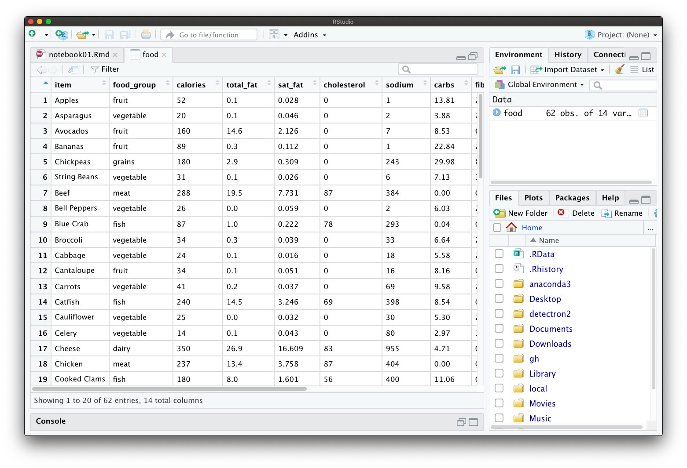

```{r, include=FALSE}
source("../funs/funs.R")
```

## Running RMarkdown in RStudio

All of the code that we will work through this semester will be stored as
RMarkdown files, which have a `.Rmd` extension. These files are great because
they allow us mix code and descriptions within the same file. Reading these
notes will give you brief overview of how this works; we will practice hands-on
in class.

When opening an RMarkdown file in RStudio, you should see a window
similar to this (it will be slightly different on Windows and depending
on your screen size):


On the left is the actual file itself. Some output and other helpful
bits of information are shown on the right. There is also a Console
window, which we generally will not need. I have minimized it in
the graphic.

Notice that the file has parts that are on a white background and other
parts that are on a grey background. The white parts correspond to
text and the grey parts to code. In order to run the code, and to see
the output, click on the green play button on the right of each block.

When you run code to read or create a new dataset, the data will
be listed in the Environment tab in the upper right hand side of
RStudio:


Clicking on the data will open a spreadsheet version of the data that
you can view to understand the structure of your data and to see all
of the columns that are available for analysis:



Going back to the RMarkdown file by clicking on the tab on the upper
row, we can see how graphics work in R. We have written some code to
produce a scatter plot. When the code is run, the plot displays inside
of the markdown file:


Make sure to save the notebook frequently. However, notice that only
the text and code itself is saved. The results (plots, tables, and
other output) are not automatically stored. This is actually helpful
because the code is much smaller than the results and it helps to
keep the file sizes small. If you would like to save the results in
a way that can be shared with others, you need to *knit* the file
by clicking on the Knit button (it has a ball of yarn icon) at the
top of the notebook. After running all the code from scratch, it will
produce an HTML version of our script that you can open in a web
browser:


In fact, the notes that you are currently reading were created with
RMarkdown files that are knitted to HTML.

## Running R Code

We now want to give a very brief overview of how to run R code. We
will now only show snippets of R code and the output rather than a
screen shot of the entire RStudio session. Though, know that you
should think of each of the snippets as occuring inside of one of
the grey boxes in an RMarkdown file.

In one of its most basic forms, R can be used as a fancy calculator.
For example, we can divide 12 by 4:

```{r}
12 / 4
```

We can also store values by creating new *objects* within R. To do
this, use the `<-` (arrow) symbol. For example, we can create a new
object called `mynum` with a value of `8` by:

```{r}
mynum <- 3 + 5
```

We can now use our new object `mynum` exactly the same way that we we
would use the number 8. For example, adding it to 1 to get the number nine:

```{r}
mynum + 1
```

Object names must start with a letter, but can also use underscores and
periods. This semester, we will use only **lowercase letters and underscores**
for object names. That makes it easier to read and easier to remember what
you have called things.

## Running functions

A function in R is something that takes a number of input values and
returns an output value. Generally, a function will look something like
this:

```{r, eval=FALSE}
function_name(arg1 = input1, arg2 = input2)
```

Where `arg1` and `arg2` are the names of the inputs to the function (they
are fixed) and `input1` and `input2` are the values that we will assign
to them. The number of arguments is not always two, however. There may be any
number of arguments, including zero. Also, there may be additional optional
arguments that have default values that can be modified.

Let us look at an example function: `seq`. This function returns a sequence
of numbers. We will can give the function two input arguments: the starting
point `from` and the ending point `to`.

```{r}
seq(from = 1, to = 7)
```

The function returns a sequence of numbers starting from 1 and ending at
7 in increments of 1. The return values are shown (in this document) right below
the code block. Note that you can also pass arguments *by position*, in
which case we use the default ordering of the arguments. Here is the same code
but without the names:

```{r}
seq(1, 7)
```

There is also an optional argument `by` that controls the spacing between
each of the numbers. By default it is equal to 1, but we can change
it to spread the point out by half spaces.

```{r}
seq(from = 1, to = 7, by = 0.5)
```

We will learn how to use numerous functions in the coming notes.

## Loading data

In these notes we will be working with data that is stored in a tabular
format. Here is an example of a tabular dataset of food types, which
has nine rows and five columns. Each row tells us the nutritional
properties contained in 100 grams of a particular type of food.


Every row of the dataset represents a particular object in our dataset,
each of which we call an *observation*. In our food type example, each
individual food corresponds to a specific observation:


The columns in a tabular dataset represent the measurements that we
record for each observation. These measurements are called *features*.
In our example dataset, we have five features which record the name
of the food type, the food group that the food falls into, the number
of calories in a 100g serving, the amount of sodium (mg) in a 100g
serving, and the amount of vitamin A (as a percentage of daily recommended
value) in a 100g serving.


A larger version of this dataset, with more food types and nutritional
facts, is included in the course materials. We will make extensive use
of this dataset in the following notes as a common example for creating
visualizations, performing data manipulation, and building models. In
order to read in the dataset we use a function called `read_csv` and
pass it a description of where the file is located relative to where
this script is stored. The data is called `foods.csv` and is stored in
the folder `data`. The following code will load the foods dataset into
R, save it as an object called `food`, and prints out the first several
rows:

```{r, message=FALSE}
food <- read_csv(file = "../data/food.csv")
food
```

Notice that the display shows that there are a total of 61 rows and
17 features. The first 10 rows and 10 columns are shown. At the bottom,
the names of the additional feature names are given. As described
above, if you run this RStudio, you can view a full tabular version
of the dataset by clicking on the dataset name in the Environment tab.
The abbreviations `<chr>` and `<dbl>` tell us which features are characters
(`item`, `food_type`, `wiki`, `description`, and `color`) and which are
numbers (all the others).

Many of the examples in the following notes will make use of this foods
dataset to demonstrate new concepts. Another related dataset that will be also
be useful for illustrating several concepts contains the prices of various
food items for over 140 years. We can read it into R using similar block of
code, namely:

```{r, message=FALSE}
food_prices <- read_csv(file = "../data/food_prices.csv")
food_prices
```

Here, each observation is a year. Features correspond to specific types of
food. Notice that this is different than the `foods` dataset, in which the
food items were observations.

## Formatting

It is very important to properly format your code in a consistent way.
Even though the code may run without errors and produce the desired results,
it is extremely important to make sure that your code is well-formatted to make
it easier to read and debug. We will follow the following guidelines:

- always put one space before and after an equals sign or assignment arrow
- always put one space after a comma, but no space before a comma
- always put one space around mathematical operations (such as `+` and `*`)

It will make your life a lot easier if you get used to these rules right from
the start. We will practice and review this in class.

## Homework Questions

At at then end of each set of notes, such as this one, will be a short set of
questions or activities to complete before the next class. Bring written
solutions with you to class.

1. Make sure you have R, RStudio, and all of the packages installed. If you are
still having trouble with anything, please let me know during class.
2. On a piece of paper, make an example of a tabular dataset with five rows and
three columns. This can capture any type of information you would like. We will
share these together in class.
3. Give each of the columns of your dataset names. Try to follow the variable
name rules described above.

Once you have finished reading and completing the items above, make sure to
submit the pre-class form.
