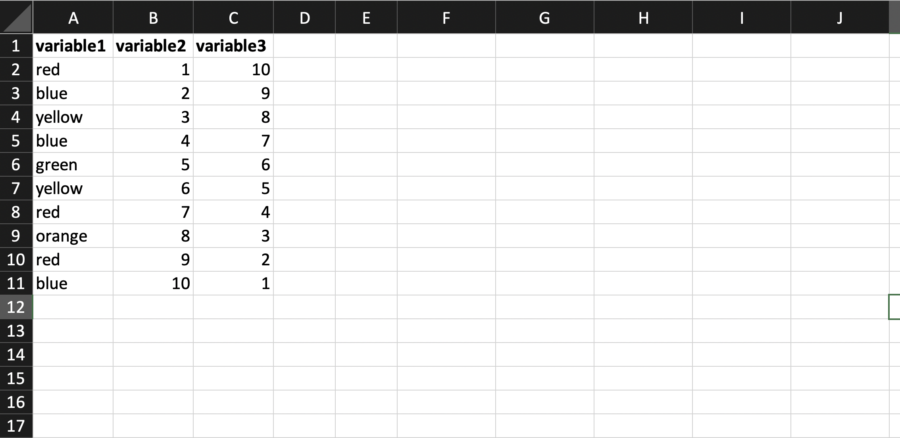
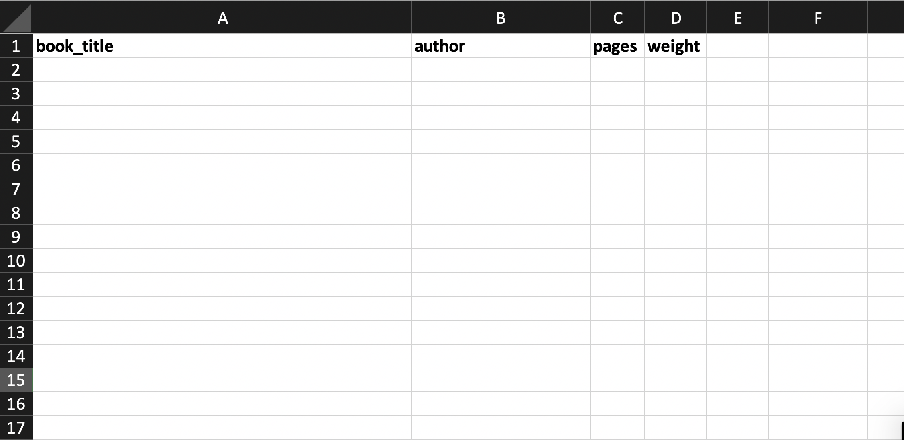
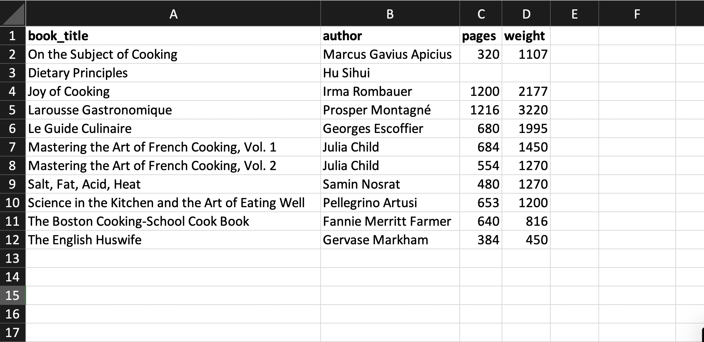
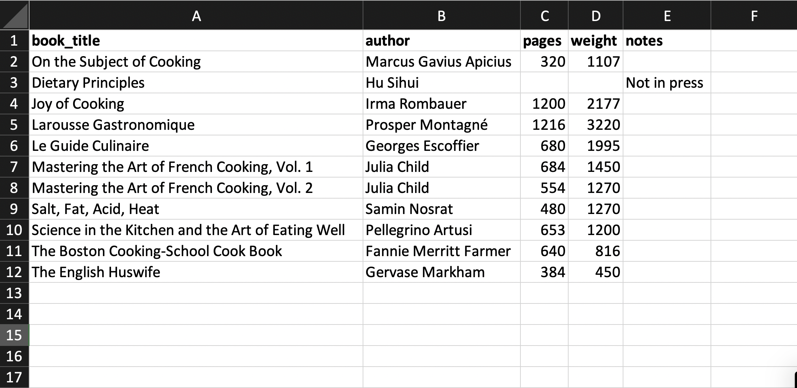
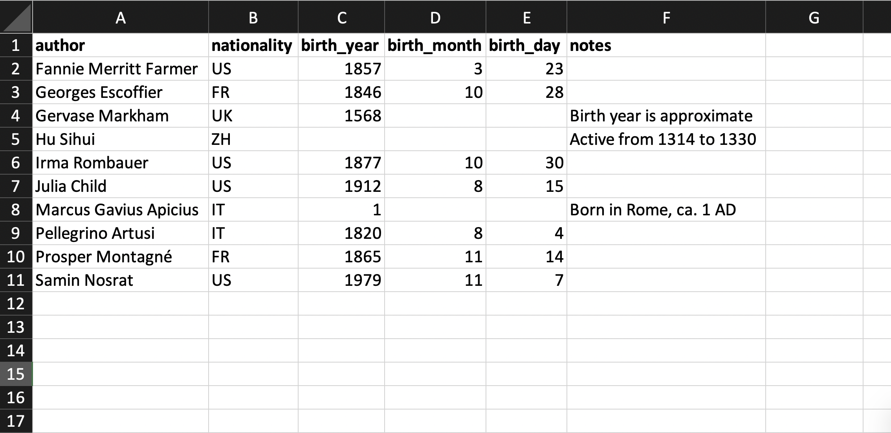
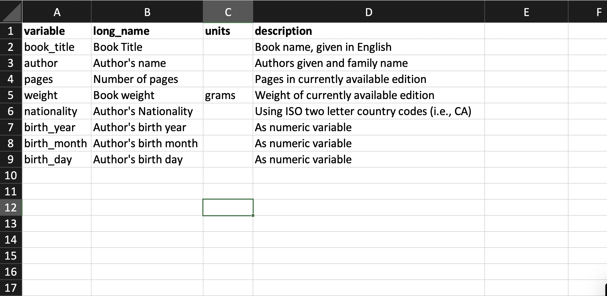

```{r, include=FALSE, message=FALSE}
source("../funs/funs.R")

food <- read_csv(file.path("..", "data", "food.csv"))
food_prices <- read_csv(file.path("..", "data", "food_prices.csv"))
```

### Overview

Its a well-known aphorism within data science
that the majority of an analysis consists in cleaning and validating our data.
If we can collect our data in a clean format from the start, it will allow us
to proceed directly to the exploration stage once the data have been collected.

There are number of excellent articles that give an extensive overview of how
to collect and organize data. Hadley Wickham's
["Tidy Data"](https://www.jstatsoft.org/article/view/v059i10),
one of the most citing papers across all of data science, offers an extensive
theoretical framework for describing a process for collecting data sets.
Karl Broman and Kara Woo's
["Data Organization in Spreadsheets"](https://www.tandfonline.com/doi/full/10.1080/00031305.2017.1375989).
offers a balanced between practical advice and an extended discussion of general
principles for collecting data sets. The Data Carpentry guide
[Data Organization in Spreadsheets](https://datacarpentry.org/spreadsheet-ecology-lesson/02-common-mistakes/)
provides a concise list of common pitfalls.

These notes provides a summarized set advice for organizing and storing data
within a spreadsheet program. Rather than an extensive discussion of various
pros and cons, it primarily focuses on the explicit approaches that I recommend.
For readers interested in a broader coverage, I suggest reading the articles
cited above. Because we are not using any fancy spreadsheet functions here, any
program that you would like to use should be fine. The screenshots come from
Microsoft Excel, but the same approach will work in Google Sheets, LibreOffice,
or another spreadsheet program of your choosing.

### Rectangular data

We have frequently discussed the concept of a rectangular data set, with
observations in rows and features in columns. This is the same format that
we will use to collect our data. The first thing you will need to do, then, is
determine what *things* you are observing and what *properties* you would like
to collect about each thing. If you are observing different different kinds of
things, each of which has a different set of associated properties, you may
need to store each set in a different table.

To match the format of rectangular data that we have been working with in R,
we need to structure our data set with a single row of column names, followed
by a row of data for each observation. Here is an example from Excel of a
nonsense data set with three features:



Notice that we need to always start in the first cell, A1, and fill in a
consistent number of rows and columns. We do not have multiple tables scattered
around the spreadsheet. We do not have multiple header columns. It is just the
data itself, stored in an contained rectangle in the upper-left hand corner of
our spreadsheet. It is okay to include a small amount of formatting of the cells
to help with the data-entry process (I like the make the first row bold), but
do not try to record measurable properties of your data with formatting.

### Naming things

It is important to choose good feature names. As we have seen, the feature
names in a data set are used to describe
the graphics in the grammar of graphics and for manipulating data with verbs.
If our names are too complex or
difficult to remember, it will be more difficult to create data visualizations.
When feature names contain spaces or other special characters, it can become nearly
impossible to work within R without first cleaning up the feature names after
loading the data.

I find the best approach to feature names is to only use lower-case letters,
numbers, and underscores. The underscores can be used in place of spaces, but
do not make feature names more complex than needed. Also, make sure to start
the name of a feature with a lower-case letter (starting with a number is
invalid in R and many other programming languages). Note that I recommend using
lowercase even for feature names that should be capitalized, such as acronyms
and proper nouns. If you selectively capitalize, you will always need to
remember where this was done. In my scheme, it is one less thing to remember.

Throughout the rest of these notes, continuing with the food theme, we will
show examples of a small data set collecting information about a set of
cookbooks. Here is the table before filling in any information, with just the
row names.



For the specific features within a data set, spaces, capital letters, and
other special characters are fine. Just be consistent. Do not use "female" in
one observations, "Female" in another, and "F" in a third. Just pick the format
and stick to it. Where applicable, try to use standards-based labels (ISO
country codes or U.S. Postal service state abbreviations). This will help if
you later want to merge your data set with other sources.

### One thing in each cell

Within each cell, there should only be one piece of information. In particular,
this means that cells should not contain units or current symbols. If you have
data collected in different units, create a new column and put the units there.
Though, it is best to store everything on the same scale.
If there is something to note about a particular value, do not put a star or
other mark with it. Create a new column. This also means that,
as mentioned above, you should not try to store two things in one cell by using
formatting to indicate a secondary piece of information. Again, if you have two
things to indicate, create a new column. Here is an example of our cookbook
data set with these principles applied:



If you need to include explanatory notes for some of the data, which is often
a great idea, do not abandon the rectangular data format. Instead, include an
extra column of notes with its own name. For example, here we explain that one
of our books is out of print:



In our example table, the number of pages and weight of one book is missing
because it is out of print. In order to indicate this, the corresponding cell
is blank. Blank values are the only cross-software way to indicate missing
values in a consistent way.

### Dates

Date features are a well-known source of error in the collecting and recording
of data. My recommendation for the most flexible and least error-prone method
is to simply record each component of a date as its own column. This means,
one column for year, one for month, and one for day. It will be much easier to
work with if you keep months as numbers rather than names. If you have time
information as well, this can be recorded by putting the hours, minutes, and
seconds as their own columns.

One benefit of this method is that it will be easy to record historical data
in cases where you may not be sure of the month or day for every row of the
data set. For example, here is a data set showing properties of the cookbook
authors from our data set:



There is an ISO standard (ISO 8601) for representing dates and times in a
consistent way: `YYYY-MM-DD`. This is often a great format for
storing data, and one that is used in several example data sets this semester,
but (1) can lead to errors when opening and re-saving in a spreadsheet program
and (2) cannot easily store dates with unknown information. I suggest using the
separate column approach while collecting your initial data set. Later, if you
re-save a modified data set *from within R*, the ISO 8601 format is a good
option.

### Output format

Most sources on collecting data suggest storing your results in a plaintext
format. This is a stripped down representation of the data that contains no
formatting information and is application agnostic. Excel, GoogleSheets,
LibreOffice, and any other spreadsheet program you come across, should be able
to save your data set in a plaintext format. The most commonly used type is
called a comma seperated value (or "csv") file. Here, columns are split by
commas and each row is on its own line. Here is what the csv file of our
cookbook authors data set looks like:

```
feature,long_name,units,description
book_title,Book Title,,"Book name, given in English"
author,Author's name,,Authors given and family name
pages,Number of pages,,Pages in currently available edition
weight,Book weight,grams,Weight of currently available edition
nationality,Author's Nationality,,"Using ISO two letter country codes (i.e., CA)"
birth_year,Author's birth year,,As numeric feature
birth_month,Author's birth month,,As numeric feature
birth_day,Author's birth day,,As numeric feature
```

Nearly all of the data sets we work with in this class are stored as CSV files.
One thing to be careful of, particularly when using Excel, is that if your computer
is configured for a language that uses a comma as a decimal separator, the default
csv output may actually use a semicolon (`;`) in place of a comma. To read these
files in R, just replace the `read_csv` with the function `read_csv2`.

Unlike some other sources, I am less strict about the need to only export data
as a plaintext file. This is the best way for sharing and storing a data set once
an analysis is finished, but if you are going to continue adding and changing
your data set, it may actually be preferable to store your data in an `.xlsx`
file (it avoids errors that are introduced when converting back and forth
between excel and plaintext formats). Data can be loaded directly from an
excel file with the **readxl** package. Here is the syntax for using the
package to read in a data set, with either the first sheet or a named sheet:

```{r, eval=FALSE}
library(readxl)
data <- read_excel("authors.xlsx")                      # load the first sheet
data <- read_excel("authors.xlsx", sheet = "sheetname") # load sheet by name
```

Once you are finished with the data collection and cleaning processing, then
it is a good idea to store your data in a plaintext format for sharing and
long-term preservation.

### Data dictionary

So far, our discussion has focused on the specifics of storing the data itself.
It is also important to document exactly what information is being stored in
your features. To do this, we can construct a *data dictionary*. This should
explain, for each feature, basic information such as the feature's name,
measurement units, and expected categorical values. Any decisions that needed to
be made should also be documented. A data dictionary can be a simple text file,
or can be stored itself as a structured data set. Here is an example of a data
dictionary for our authors data set:



We included a long name for each feature, which will be useful when creating
improved graphics labels when preparing data visualizations for publication.

### Summary

There is a lot of information passed along here. For future
reference, here are the key formatting guidelines for storing data sets in
spreadsheets:

- record a single row of column names, starting in cell A1, followed by rows
of observations
- only used lowercase letters, numbers, and underscores in column names; always
start the name with a letter, and keep the feature names relatively short
- when recording categorical features, keep the codes consistent
- only one thing in each cell; no units, currency symbols, or notes
- keep a separate notes column if needed
- blank cells within the rectangle are used if and only if the data is missing
- save dates by storing year, month, day, hour, ect. as their own columns
- save results as an `xlsx` file while in the middle of data collection; save
as a `csv` file for long-term storage and sharing
- create a data dictionary to record important information about your data set

As mentioned in the introduction, this is an opinionated list and some other
options are equally valid. The most important thing, however, is consistency,
so I will expect that you follow the formatting advice here when collecting data.

## Homework Questions

Since you had an exam last week, there is no homework here beyond reading the
notes. We will discuss and practice the ideas presented here together in class.
